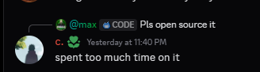

# Funny Arc Throw Macro (Open Source)

This repository restores the source code for the "Funny Arc Throw" macro. The original developer refused to share it, claiming that compiled Python EXEs are impossible to reverse engineer.

We manually disassembled the Python 3.14 bytecode to prove otherwise.

### The Reality

The "undecompilable" EXE was just a standard Python script using `tkinter` and `pynput`. We stripped the broken headers and compiled bloat so you can run the raw code safely.

### ⚠️ Community Warning

**Don't run sketchy, key-authenticated macros that try to profit from free community discoveries.** If the technique was discovered by the community, you shouldn't have to run opaque, gatekept EXEs to use it. Support open source.

**Note:** This project was open sourced for educational purposes to demonstrate that compiled Python is not secure.

**Credits:** Reverse engineered from the "impossible" [`MacroUI.exe`](https://github.com/chocolateess/macro_arc).